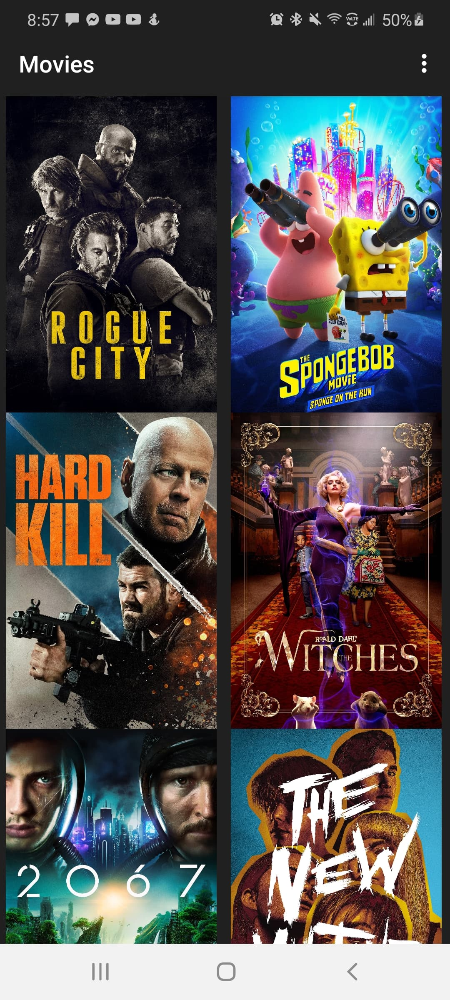
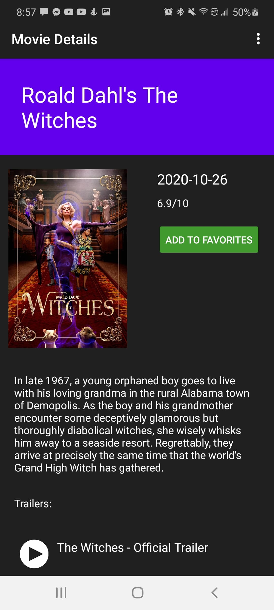
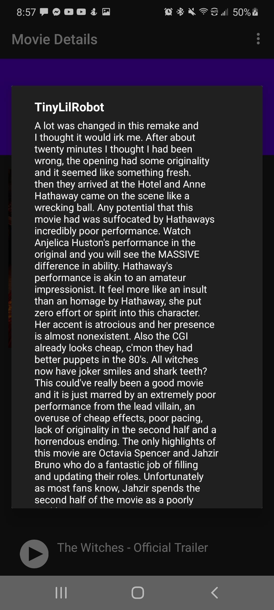
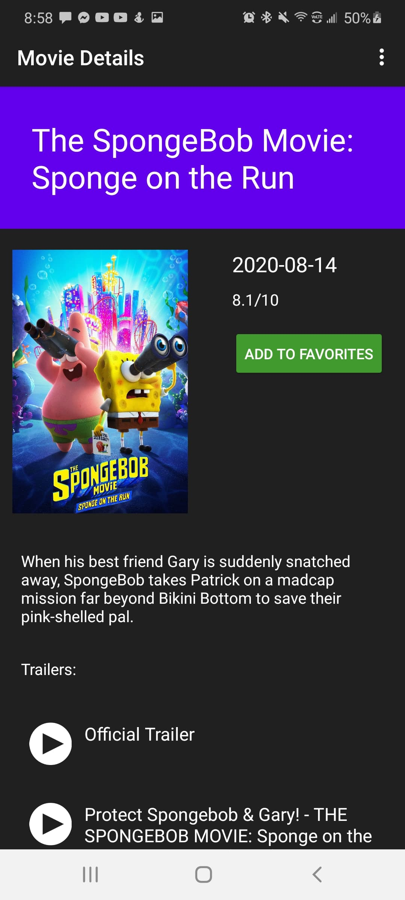

# Popular-Movies-App

This is a basic application that helps users discover new movies and keep track of their favorite movies that are currently in theaters. It uses the web API from themoviedb.org to populate the UI with text and images that are received as a JSON response from the API request. 
(This is the first assignment in the online course "Udacity Android Development Nanodegree", this project was written from scratch using skills learned from the first module of the course)

**Features**
- View Movie Trailers 
- Read Movie Reviews
- Save Movies to Favorites

# Screenshots
 -----------

 